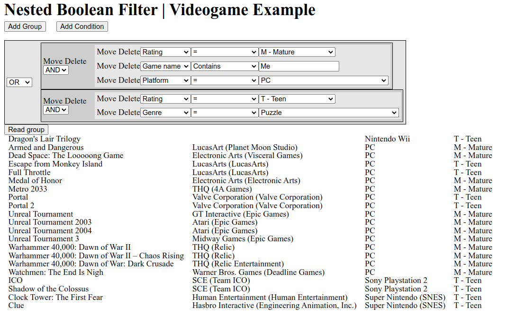

# Nested Boolean Filter

nbfilter is a reimplementation of a filtering system I created for CONNECT using video games.

# Setup

- Install MySQL and PHP's PDO and JSON extensions.
- Create a MySQL user for this if desired and change the PDO arguments in `nbfilter.php` to match.
- Run `CREATE DATABASE games;` in the MySQL shell and import the database either by `use games; source games.sql` or `mysql -u root games < games.sql` in the UNIX shell (add -p if your login has a password).

**OR**
- `docker compose up`
